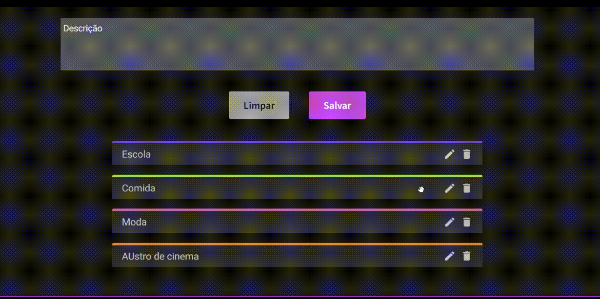
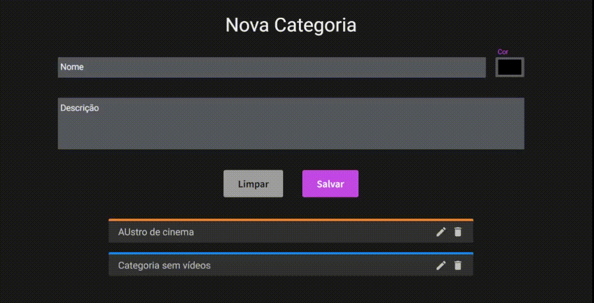

 

    
O DogFlix é uma plataforma de vídeos customizável. O projeto surgiu a partir de um desafio proposto pelo programa "ONE - Oracle Next Education", parceria da Oracle com a plataforma Alura.

<h3>▶ Como rodar:</h3>

    
Você pode acessar <a href="https://dogflix-psi.vercel.app/">clicando aqui</a>.
    

<h3>🦴 Sobre o DogFlix:</h3>
🐾 A página inicial apresenta as categorias, sua descrição e um carousel com seus vídeos;
  

  
🐾 A primeira categoria tem um vídeo em destaque, mostrando seu nome, descrição e, na versão em desktop, o próprio vídeo no background;
  

  
🐾 Para adicionar um novo vídeo, o formulário faz as validações necessárias além de impedir links inválidos ou repetidos em uma mesma categoria. Também conta com o botão de limpar o formulário; 
  

  
🐾 Quando o vídeo é adicionado, um modal avisa do sucesso e oferece a opção de redirecionamento para a página do vídeo;
  

  
🐾 Já na página de nova categoria, além das validações e opção de limpar, temos uma lista com todas categorias já existentes onde é possível:
  
◽ Editar a categoria:
  

  
◽ Visualizar e deletar vídeos da categoria:
  

  
◽ Alterar a sequência das categorias (o que altera o vídeo em destaque na home):
  

  
◽ Remover a categoria, desde que as sobressalentes tenham vídeos:
  

  
🐾 Usei o localStorage para que, mesmo recarregando a página, os dados fiquem salvos no navegador.
  
🐾 O site é responsivo:
 

    
    

